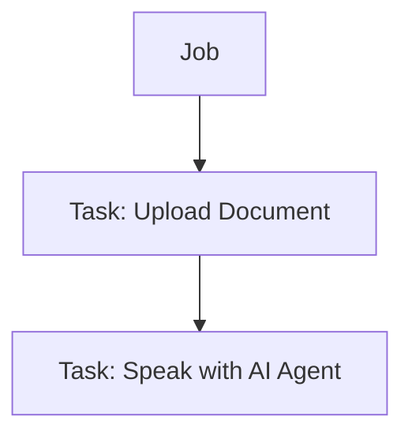

## Definition
A **Task** is a single step inside a Job that needs to be performed by an AI agent, a human user or a system.

Each Task is created from a Workflow **Action** and includes the input, logic and expected outcome for that specific step.

## What Tasks Do

- Represent a **unit of work** inside the larger journey 
- Represents a specific action to be taken, like uploading a document or speaking with an agent
- Can be handled by **Realtime** or **Task Agents**  
- Carry all necessary **input/output**, instructions and agent configuration  
- Are tracked for **status**, execution time and result  
- Trigger assigned **tools** and use assigned **sources**

## Common Task Examples

- Upload and verify a document  
- Join a video call with an AI agent  
- Fill out a form with guided AI support  
- Analyze an invoice and extract data  
- Route a case based on form values  

## 🖼️ Visual Overview

## Example Use Cases

<Card title="Identity Upload Task" horizontal>
  A Task where the customer uploads their ID, which is then processed by a Task Agent.
</Card>

<Card title="Live Help Session" horizontal>
  A Realtime Task where the user is assisted by an AI agent over voice or chat.
</Card>

<Card title="Form Validation" horizontal>
  A Task where a user fills a form and an MCP tool checks validity before continuing.
</Card>

## Task Metadata

Each Task contains:

- Assigned agent  
- Status (pending, active, completed)  
- Triggered tools  
- User and session context  
- Input/output data  
- Logs and timestamps  

---

> ✅ Tasks are how **Actions become real**, visible steps in a running workflow.