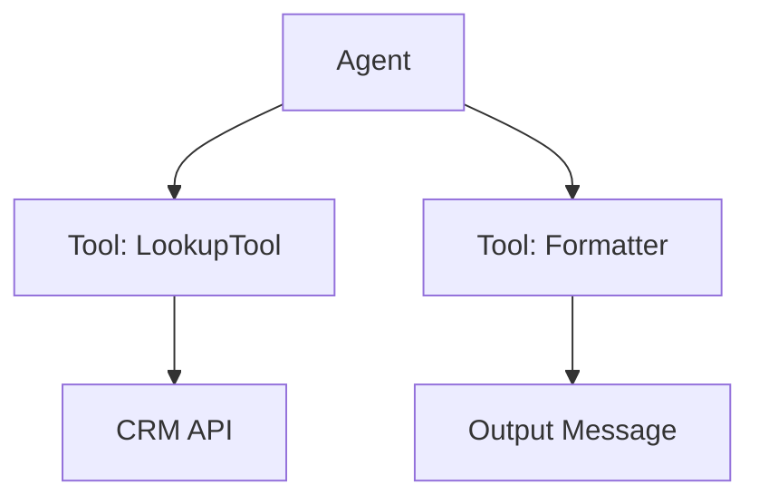

## Definition

**Tools** in Agentix are powerful logic components that extend the behavior of your PowerLinks and agents. They enable your system to interact with external APIs, process data, run validations or connect to custom services.

Tools can be used by AI agents during task or live interactions, giving them the ability to reason, take actions or retrieve dynamic content.

## Types of Tools

Agentix supports two main types of tools:

### ⚙️  Built-in Tools

These tools are natively provided by the Agentix platform and require no custom code.

Common examples include:

- **📤 File upload** – requests user for document upload and extract data from uploaded image or document if needed. 
- **🔎 Data lookup tools** – query customer records, product info or pricing  
- **📬 Messaging tools** – send WhatsApp, email or system notifications  
- **📄 Form Input** – Request user for form input and collect submitted data

✅ These tools are configurable via the UI and can be reused across PowerLinks and actions.

### 🔌  MCP Tools

**Model Context Protocol (MCP)** tools are custom tools hosted on your own infrastructure. You can define and expose these tools by running your own **MCP server** and registering the tool metadata.

- Use any language or framework to build your logic  
- The MCP protocol ensures compatibility with Agentix agents  
- Tools are automatically discovered and usable by agents during tasks or conversations  
- Ideal for secure, internal logic or external API orchestration

Examples of custom MCP tools:

- CRM lookup tool  
- Internal approval API trigger  
- Real-time calculation or eligibility check  
- Proprietary business rules engine  

✅ These tools are ideal when you need custom, private or advanced logic.

## Tool Assignment

Tools can be attached to agent assignment in actions, making them callable during task or real-time interactions.

Agents can invoke tools autonomously based on prompts or users can be guided to activate tools through conversation.

## Visual Overview

---

## Example Use Cases

<Card title="Document Summarizer" icon="file-text" horizontal>
  A built-in tool that summarizes long documents uploaded by the customer. Used by a task agent to generate a short summary inside the task response.
</Card>

<Card title="Eligibility Checker" icon="check-circle" horizontal>
  A custom MCP tool that verifies user eligibility against internal systems before proceeding to the next step in the workflow.
</Card>

<Card title="WhatsApp Notifier" icon="message-circle" horizontal>
  A built-in messaging tool used by an agent to notify a user with updates or results after task completion.
</Card>

---

## Best Practices

- Use **descriptive names** for tools so agents can reference them easily  
- Group tools logically (e.g. finance tools, customer tools, document tools)  
- Keep tool logic stateless and focused on a single responsibility  
- Secure sensitive MCP tools behind authentication if required

---

> 👉 To build your own MCP tools, check the [MCP Developer Guide](/developer-guide/mcp-tools).